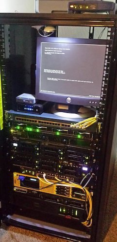
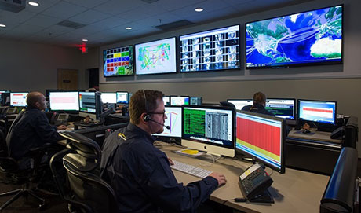
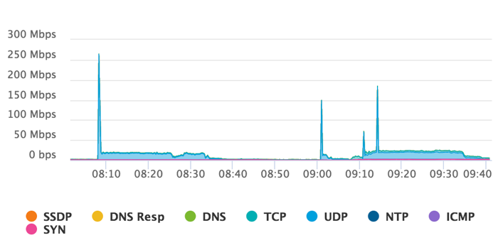

<!-- Local Page style -->
<style scoped>
h1 {
  color: #4e8fc7;
}
h2 {
    color: #455a64;
    color: #f97c28;
}
img {
    float: left;
    margin-left: -40px;
}
pre {
    margin: -33px 50px 0px;
    width: 810px;
    float: right;
}pre > code {
    background-color: #f8f8f8;
    color: #4d4d4c;
}
</style>
<!--
_class: lead
_footer: '' 
_paginate: false
-->
<!-- End Local Page style-->

<!-- Slide starts -->

<br />

# Introduction

<br />

## Network Monitoring, Management and Automation

<br />

### npNOG 5

Dec 8 - 12, 2019

[](http://creativecommons.org/licenses/by-nc/4.0/)

```licence
This material is licensed under a Creative Commons Attribution-NonCommercial 4.0 International License (http://creativecommons.org/licenses/by-nc/4.0/)
```

---

## Objectives

### <!-- fit --> Introduce Core Concepts & Terminology

- Network Monitoring & Management
- What & Why we Monitor
- What & Why we Automate
- Uptime Expectations & Calculations
- Baseline Performance & Attack Detection
- What & Why we Manage
- Network Monitoring & Management Tools
- The NOC: Consolidating Systems

---

## <!-- fit --> NOC: Consolidating NMM Systems

#### NOC = Network Operations Center

- Coordination of tasks, handling of network related incidents (ticketing system)
- Status of network and services (monitoring tools)
- Where the tools are accessed
- Store of Documentation (wiki, database, repository ==> network documentation tool(s))

---

## <!-- fit --> NOC: Consolidating NMM Systems (contd...)

#### NOC Location

- NOC is an organizational concept
- Does not need to be a place, or even a single server
- Remote / Distributed NOC is valid with OOB Management

---

<style scoped>
img {
    float: left;
    margin: 1px 10px 10px;
}
</style>

<!-- Need to add NOC images (examples) -->




---

## <!-- fit --> Network Monitoring, Management and Automation

<br />

- Monitoring
  – Check the status of a network
- Management
  – Processes for successfully operating a network
- Automation
  - Technology by which a process or procedure is performed with minimal human assistance.

---

<style scoped>
img {
    display: block;
    float: right;
    margin: 60px auto;
    padding:0;
    width:70%
}
</style>

## <!-- fit --> Monitoring Systems & Services
<!-- Need to add background image of monitoring -->


### Systems

- Routers
- Switches
- Servers

### Services

- DNS
- HTTP
- SMTP
- SNMP

---

## Why do we Monitor?

- Are Systems and Services Reachable?
- Are they Available?
- What's their Utilisation?
- What's their Performance
  - Round-trip times, throughput
  - Faults and Outages
- Have they been Configured or Changed?
- Are they under Attack?

---

## Why do we Monitor? (contd...)

- Know when there are problems – before our customers!
- Track resource utilisation, and bill our customers
- To Deliver on Service Level Agreements (SLAs)
  - What does management expect?
  - What do customers expect?
  - What does the rest of the Internet expect?
- To prove we're delivering
  - Have we achieved Five Nines? 99.999%
- To ensure we meet SLAs in the future
  - Is our network about to fail? Become congested?

---

## Uptime Expectations

- What does it take to deliver 99.9% uptime?
  - Only 44 minutes of downtime a month!
- Need to shut down one hour a week?
  - That's only 99.4% uptime ((732-4)/732 = .9945355...)
- Maintenance might be negotiated in SLAs
- What does it mean that the network is up?
  - Does it work at every location? Every host?
  - Is the network up if it works at the Boss's desk?
  - Should the network be reachable from the Internet?
---

## Establishing a Baseline

- Monitoring can be used to Establish a Baseline
- Baseline = What's normal for your network?
  - Typical latency across paths
  - Jitter across paths
  - Load on links
  - Percent Resource Utilisation
  - Typical amounts of noise
    - Network scans & random attacks from the Internet
    - Dropped packets
    - Reported errors or failures

---

## Detecting Attacks

- Deviation from baseline can mean an attack
- Are there more flows than usual?
- Is the load higher on some servers or services?
- Have there been multiple service failures?

These things could mean an attack
<!-- add image of spiked data -->


---

## What do we Manage?

- Asset management: What equipment have we
deployed?
  - What software is it running
  - What's its configuration (hardware & software)
  - Where is it installed
  - Do we have spares?
- Incident management: fault tracking and resolution
- Change management: Are we satisfying user requests?
  - Installing, moving, adding, or changing things
- Staff management

---

## Why do we Manage?

- To ensure we meet business requirements for service level, incident response times etc
- To make efficient use of our resources (including staff)
- To learn from problems and make improvements to reduce future problems
- To plan for upgrades, and make purchasing decisions with sufficient lead time

---

## Why do we Automate?

- frees up time spent doing mundane (repetitive, boring, unproductive and yet necessary) tasks to focus on more important work.
- reduces mistakes in routine tasks.
- allows everyone on the team to be productive.
- reduces documentation workload.

---

## What do we Automate?

- Routine tasks
- Repeatable tasks
- Complex tasks
- Time-consuming tasks

---

## When do we Automate?

- when you are ready and confident
- when need arise

<!-- need to elaborate -->

---

## How do we automate?

- only the person implementing automation can answer

<!-- need to elaborate -->

---

## Network Monitoring Tools

- Availability: [Nagios](https://www.nagios.org/projects/nagios-core/)
  - for servers, services, routers, switches, environment
- Reliability: [Smokeping](https://oss.oetiker.ch/smokeping/)
  - connection health, rtt, service response time, jitter
- Performance: [LibreNMS](https://www.librenms.org/), [cacti](https://www.cacti.net/)
  - traffic, port utilisation, cpu, RAM, disk, processes

Integration & overlap exists between these programs!

---

## Network Management Tools

- Ticket Systems: [RT](https://bestpractical.com/request-tracker)
  - Manage provisioning & support
- Configuration Management: [RANCID](https://www.shrubbery.net/rancid/)
  - Track router configurations
- Network Documentation: [Netdot](https://github.com/cvicente/Netdot)
  - Inventory, Location, Ownership of Network Assets

Integration & overlap exists between these programs!

---

## Automation Tool

- Automation Tool: [Ansible](https://www.ansible.com/)
  - an IT automation tool - Automate, Accelerate, Collaborate, Integrate, Configuration, Change Management
- Alternatives:
  - [SaltStack](https://www.saltstack.com/)
  - [Puppet](https://puppet.com/)
  - [Chef](https://www.chef.io/)

---

## A few Open Source NMM Tools

```
| ------------|-------------------|----------------|-----------|-----------|
| Performance | Change Management | Net Management | Ticketing | Utilities |
|-------------|-------------------|----------------|-----------|-----------|
| flowc       | Mercurial         | Cacti          | RT        | SNMP      |
| mrtg        | RANCID            | LibreNMS       | Trac      | Perl      |
| NetFlow     | CVS               | Nagios         | Redmine   | Ping      |
| NfSen       | Subversion        | OpenNMS        |           | Python    |
| ntop        | git               | Zabbix         |           |           |
| RRDTool     | SNORT             | Netdot         |           |           |
| SmokePing   | Nessus            | IPplan         |           |           |
| ------------|-------------------|----------------|-----------|-----------|
```

---

## NMM Review

- Network Monitoring & Management
- What & Why we Monitor
- Uptime Expectations & Calculations
- Baseline Performance & Attack Detection
- Network Attack Detection
- What & Why we Manage
- Network Monitoring & Management Tools
- The NOC: Consolidating Systems

---

<!--
_class: lead
_paginate: false
-->

## <!--fit--> :question:

<!-- Slide end -->
