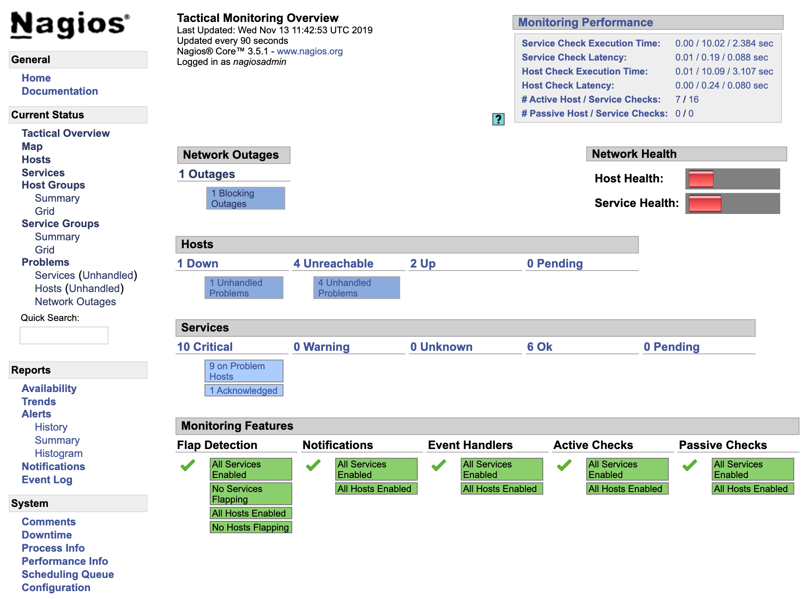
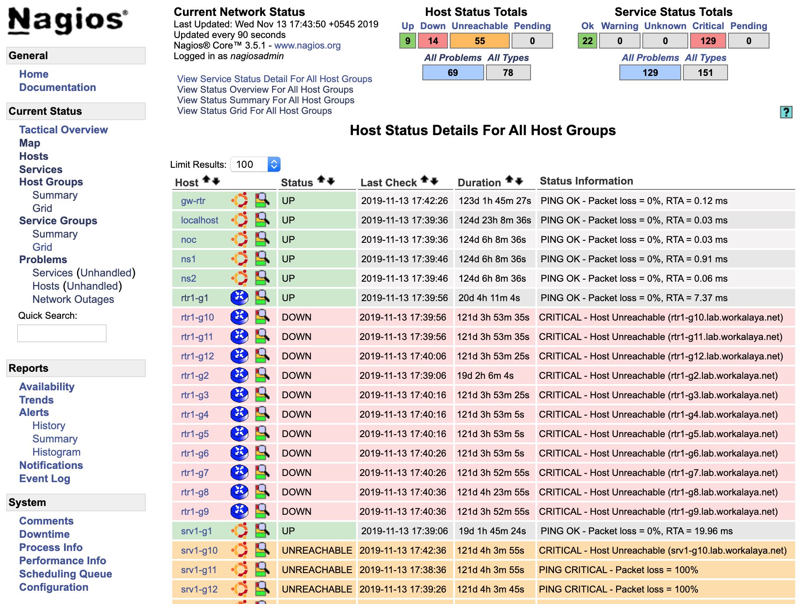
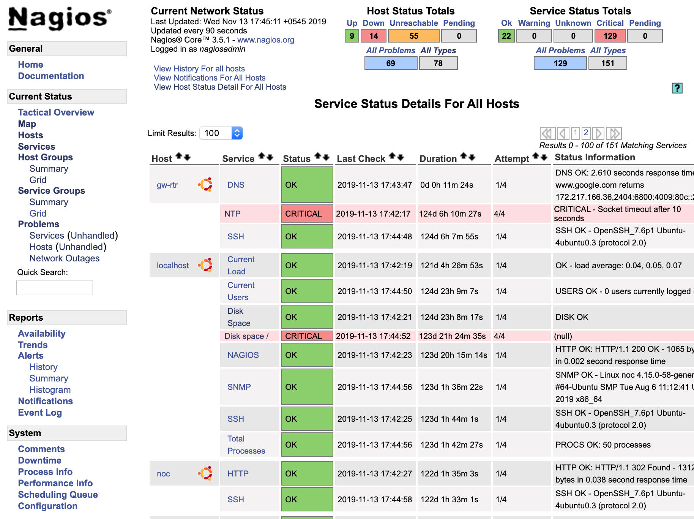
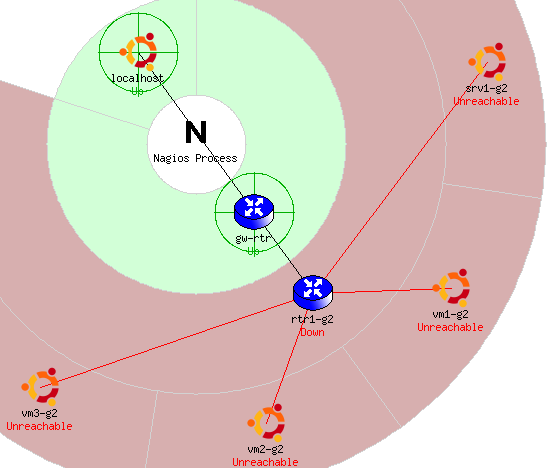
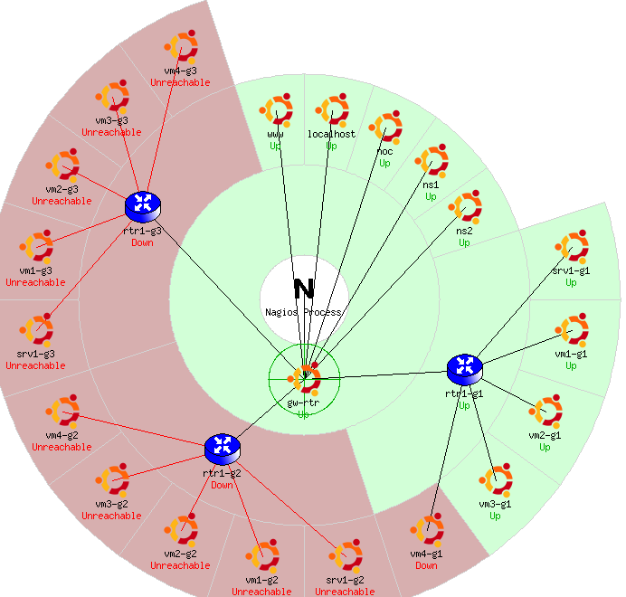

<!-- Local Page style -->
<style scoped>
h1 {
  color: #4e8fc7;
}
h2 {
    color: #455a64;
    color: #f97c28;
    visibility:hidden;
}
img {
    float: left;
    margin-left: -40px;
}
pre {
    margin: -33px 50px 0px;
    width: 810px;
    float: right;
}
pre > code {
    background-color: #f8f8f8;
    color: #4d4d4c;
}
</style>
<!--
_class: lead
_footer: '' 
_paginate: false
-->
<!-- End Local Page style-->

<!-- Slide starts -->
<br />


# <!-- fit --> Network Monitoring, Management and Automation

<br />

## Nagios

<br />
<br />
<br />

### npNOG 5

Dec 8 - 12, 2019
<br />

[](http://creativecommons.org/licenses/by-nc/4.0/)

```licence
This material is licensed under a Creative Commons Attribution-NonCommercial 4.0 International License (http://creativecommons.org/licenses/by-nc/4.0/)
```

---

<style scoped>
img {
    float: right;
    width: 30%;
    margin: auto -20px;
}
</style>

## Introduction


- Possibly the most used open source network monitoring software
- Web interface for viewing status, browsing history,
scheduling downtime etc
- Sends out alerts via E-mail. Can be configured to use other mechanisms, e.g. SMS

---

## Introduction (Contd...)

Nagios actively monitors the _**availability**_ of

- Hosts (devices)
- Services

---

<style scoped>
h2 {
    margin-top: -35px;
    color: #455a64;
    font-size: 95%;
}
h3 {
    margin: 0 20px auto;
    padding: 0px;
    display: block;
}
</style>

## Nagios: Tactical Overview

### <!--fit--> 

---

<style scoped>
h2 {
    margin-top: -35px;
    color: #455a64;
    font-size: 95%;
}
h3 {
    margin: 0 20px auto;
    padding: 0px;
    display: block;
}
</style>

## Nagios: Host Detail View

### <!--fit--> 

---

<style scoped>
h2 {
    margin-top: -35px;
    color: #455a64;
    font-size: 95%;
}
h3 {
    margin: 0 20px auto;
    padding: 0px;
    display: block;
}
</style>

## Nagios: Service Detail View

### <!--fit--> 

---

## Features

- Utilizes topology to determine dependencies.
  - Differentiates between what is _**down**_ vs. what is _**unreachable**_. Avoids running unnecessary checks and sending redundant alarms
- Allows you to define how to send notifications based on combinations of:
  - Contacts and lists of contacts
  - Devices and groups of devices
  - Services and groups of services
  - Defined hours by persons or groups
  - The state of a service

---

<style scoped>
img {
    float: right;
    width: 30%;
    margin: -100px auto -20px;
}
</style>

## Plugins

Plugins are used to verify services and devices:

- Nagios architecture is simple enough that writing new plugins is fairly easy in the language of your choice.
- There are many, many plugins available (thousands).
  - <http://exchange.nagios.org/>
  - <http://nagiosplugins.org/>


---

<style scoped>
h3 {
    font-size: 95%;
}
pre{
    margin-top: 10px;
}
</style>

## Pre-installed Plugins for Ubuntu

### /usr/lib/nagios/plugins

```bash
check_apt       check_file_age      check_imap         check_nagios    check_pop        check_swap
check_breeze    check_flexlm        check_ircd         check_nntp      check_procs      check_tcp
check_by_ssh    check_fping         check_jabber       check_nntps     check_real       check_time
check_clamd     check_ftp           check_ldap         check_nt        check_rpc        check_udp
check_cluster   check_game          check_ldaps        check_ntp       check_rta_multi  check_ups
check_dbi       check_host          check_load         check_ntp_peer  check_sensors    check_users
check_dhcp      check_hpjd          check_log          check_ntp_time  check_simap      check_wave
check_dig       check_http          check_mailq        check_nwstat    check_smtp       negate
check_disk      check_icmp          check_mrtg         check_oracle    check_snmp       urlize
check_disk_smb  check_ide_smart     check_mrtgtraf     check_overcr    check_spop       utils.pm
check_dns       check_ifoperstatus  check_mysql        check_pgsql     check_ssh        utils.sh
check_dummy     check_ifstatus      check_mysql_query  check_ping      check_ssmtp
```

### /usr/lib/nagios/plugins
```bash
apt.cfg       dns.cfg     games.cfg     load.cfg   netware.cfg  ping.cfg     ssh.cfg
breeze.cfg    dummy.cfg   hppjd.cfg     mail.cfg   news.cfg     procs.cfg    tcp_udp.cfg
dhcp.cfg      flexlm.cfg  http.cfg      mailq.cfg  nt.cfg       real.cfg     telnet.cfg
disk-smb.cfg  fping.cfg   ifstatus.cfg  mrtg.cfg   ntp.cfg      rpc-nfs.cfg  users.cfg
disk.cfg      ftp.cfg     ldap.cfg      mysql.cfg  pgsql.cfg    snmp.cfg
```
---

## How Checks Work

- Periodically nagios calls a plugin to test the state of each service. Possible Responses are:
  - OK
  - WARNING
  - CRITICAL
  - UNKNOWN
- If a service is not OK it goes into a “soft” error state. After a number of retries (default 3) it goes into a “hard” error state. At that point an alert is sent.
- You can also trigger external event handlers based on these state transitions

---

## How Checks Work (Continued)

- **Parameters**
  - Normal checking interval
  - Retry interval (i.e. when not OK)
  - Maximum number of retries
  - Time period for performing checks
  - Time period for sending notifications
- **Scheduling**
  - Nagios spreads its checks throughout the time period to even out the workload
  - Web UI shows when next check is scheduled

---

<style scoped>
img {
    float: right;
    width: 20%;
    margin: -30px auto -20px;
}
</style>

## <!--fit--> Hierarchy: The Concept of Parents

Hosts can have parents:

- The parent of a `server` connected to a `switch` would be the `switch` or `router`.
- Allows us to specify the dependencies between devices.
- Avoids sending alarms when parent does not respond.
- A node can have multiple parents (dual homed).



---

## Network Viewpoint

- Where you locate your Nagios server will determine your point of view of the network
- The Nagios server becomes the “root” of your dependency tree

---

<style scoped>
h2 {
    margin-top: -35px;
    color: #455a64;
    font-size: 95%;
}
h3 {
    margin: 0 20px auto;
    padding: 0px;
    display: block;
}
</style>

## Network Viewpoint Map
  
### 

---

## Demo of Nagios

### <!--fit--> <http://noc.lab.workalaya.net/nagios3/>

nagioisadmin/<lab_password>

---

## Installation

- A bundle of related tasks/handlers/templates

**roles/**_\<rolename>_**/tasks/main.yml**
**roles/**_\<rolename>_**/handlers/main.yml**
**roles/**_\<rolename>_**/defaults/main.yml**
**roles/**_\<rolename>_**/files/...**
**roles/**_\<rolename>_**/templates/...**

- Recommended way to make re-usable configs
- Not all these files need to be present

---

## Ansible Tags

- Each role or individual task can be labelled with one or more "tags"
- When you run a playbook, you can tell it only to run tasks with a particular tag: -t \<tag>
- Lets you selectively run parts of playbooks

---

## Ansible Inventory

- Lists all hosts which Ansible may manage
- Simple "INI" format, not YAML
- Can define groups of hosts
- Default is /etc/ansible/hosts
  - Can override using -i \<filename>

---

<style scoped>
pre {
    font-size: 85%;
}
</style>

## Inventory (hosts) example

```ini
[dns_servers]          <-- Name of group
ns1.lab.workalaya.net  <-- Hosts in this group
ns2.lab.workalaya.net

[vms]
vm1-g1.lab.workalaya.net
vm1-g1.lab.workalaya.net

[nagios_server]
noc.lab.workalaya.net
vm1-g1.lab.workalaya.net
vm1-g1.lab.workalaya.net
```

```txt
Note:
- the same host can be listed under multiple groups.
- Group "all" is created automatically
```

---

## Inventory variables

- You can set variables on hosts or groups of hosts
- Variables can make tasks behave differently when applied to different hosts
- Variables can be inserted into templates
- Some variables control how Ansible connects

---

## Setting host vars

- Directly in the inventory (hosts) file

  ```ini
  [core_servers]
  ns1.lab.workalaya.net ansible_connection=local
  ns2.lab.workalaya.net
  ```

- In file host_vars/pc2.example.com

  ```yaml
  ansible_ssh_host: 10.10.0.241
  ansible_ssh_user: root
  flurble:
    - foo
    - bar
  ```

  - This is in YAML and is preferred

---

## Setting group vars

- **group_vars/dns_servers**

  ```yaml
  # More YAML
  flurble:
    - foo-foo
    - bar-foo
  ```

- **group_vars/all**

  ```yaml
  # More YAML, applies to every host
  ansible_ssh_user: lab
  ansible_beccome_pass: yourpass
  ```

```txt
Note: host vars take priority over group vars
```

---

## Ansible Facts

- Facts are variables containing information collected automatically about the target host
- Things like what OS is installed, what interfaces it has, what disk drives it has
- Can be used to adapt roles automatically to the target system
- Gathered every time Ansible connects to a host (unless playbook has "gather_facts: no")

---

<style scoped>
pre {
    font-size: 85%;
}
</style>

## Showing facts

```bash
~$ ansible vmX-gY.lab.workalaya.net -m setup | less

vmX-gY.lab.workalaya.net | SUCCESS => {
    "ansible_facts": {
        "ansible_all_ipv4_addresses": [
            "100.68.X.21"
        ],
        "ansible_architecture": "x86_64",
        "ansible_bios_date": "12/12/2018",
        "ansible_bios_version": "6.00",
        "ansible_cmdline": {
            "BOOT_IMAGE": "/boot/vmlinuz-4.15.0-58-generic",
            "ro": true,
            "root": "/dev/mapper/lab--main--vg-root"
        },
        "ansible_date_time": {
            "date": "2019-11-13",
            "day": "13",
            "epoch": "1573634010",
```

---

## jinja2 template examples

- Insert a variable into text
  
  ```txt
  INTERFACES="{{ dhcp_interfaces }}"
  ```

- Looping over lists

  ```jija2
  search lab.workalaya.net
  
  nameserver {{ host }}
  
  ```

---

## Many other cool features

- conditionals
  
  ```yaml
  - action: package name=apache2 state=present
    when: ansible_os_family=='Debian'
  ```

- Loops

  ```yaml
  - action: package name={{item}} state=present
    with_items:
      - openssh-server
      - rsync
      - telnet
  ```

---

## Getting up-to-date Ansible

- Your package manager's version may be old
- For Ubuntu LTS: use the PPA

  ```bash
  apt-get install python-software-properties
  add-apt-repository ppa:rquillo/ansible
  apt-get update
  apt-get install ansible
  ```
  
- or, if using python venv

  ```bash
  (venv) vmX-gY@ansible-gY:~/ansible-playbook$ pip install --upgrade ansible
  ```

---

## More info and documentation

- <https://docs.ansible.com/>
- <https://jinja.palletsprojects.com/>
- <https://yaml.org/>

---

<!--
_class: lead
_paginate: false
-->

## <!--fit--> :question:

<!-- Slide end -->
