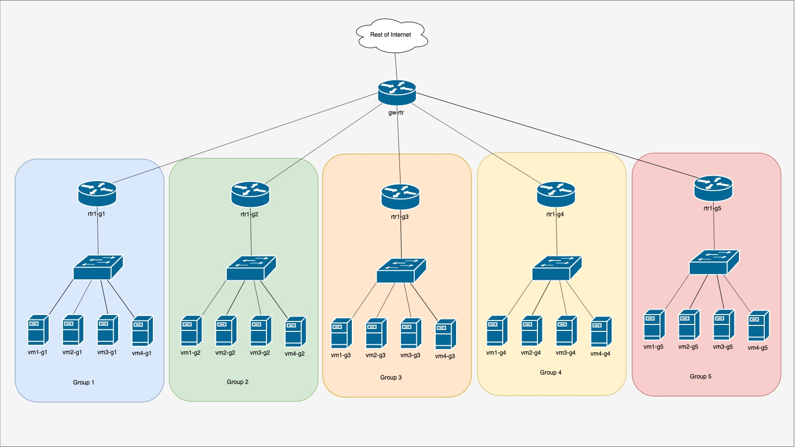
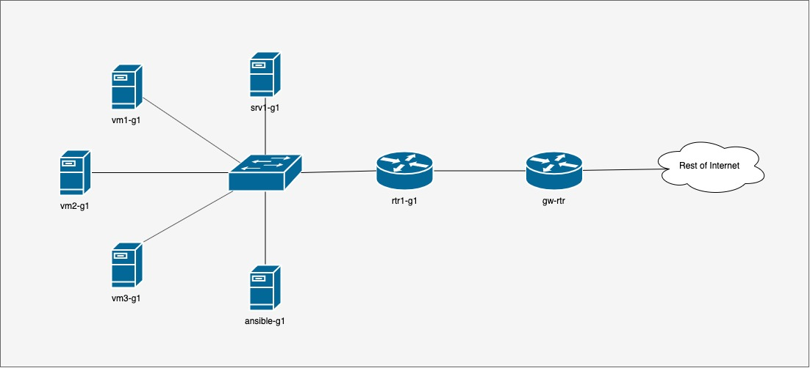
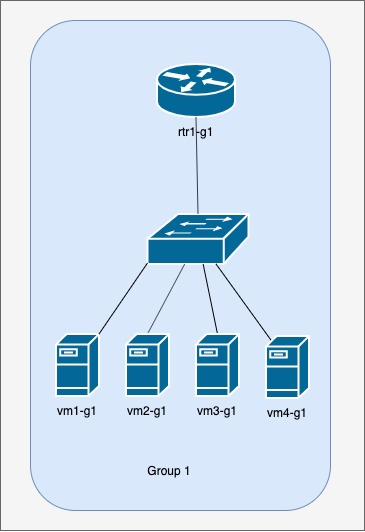

<!-- Local Page style-->
<style scoped>
h1 {
  color: #4e8fc7;
}
h2 {
    color: #455a64;
    color: #f97c28;
}
img {
    float: left;
    margin-left: -40px;
}
pre {
    margin: -33px 50px 0px;
    width: 810px;
    float: right;
}
pre > code {
    background-color: #f8f8f8;
    color: #4d4d4c;
}
</style>
<!--
_class: lead
_footer: '' 
_paginate: false
-->
<!-- End Local Page style-->

<!-- Slide starts -->

<br />

# Welcome

<br />

## Network Monitoring, Management and Automation

<br />

### npNOG 5

Dec 8 - 12, 2019

[](http://creativecommons.org/licenses/by-nc/4.0/)

```licence
This material is licensed under a Creative Commons Attribution-NonCommercial 4.0 International License (http://creativecommons.org/licenses/by-nc/4.0/)
```

---

## Workshop Schedule

| Schedule         | Time           |
|------------------|----------------|
| Session 1        | 09:30 - 11:00  |
| Break            | 11:00 - 11:30  |
| Session 2        | 11:30 - 13:00  |
| Lunch            | 13:00 - 14:00  |
| Session 3        | 14:00 - 15:30  |
| Break            | 15:30 - 16:00  |
| Session 4        | 16:00 - 17:30  |

---

## Workshop Instructors

Name                | Organization   | Country
--------------------|----------------|--------
Chatur Ratna Shakya | PCH      | Nepal
Dibya Khatiwada     | PCH      | Nepal
Srijan Bhuju        | Worldlink | Nepal
Ritesh Adhikari     | Workalaya | Nepal

---

## <!--fit--> Workshop Participants Introduction

- Name
- Organization
- Position / Field of work
- Brief work overview
- Reason for joining workshop
- Expected outcome from the event

---

## Workshop Agenda

### Agenda / Course Materials

- <http://www.lab.workalaya.net/>

### During the workshop

- Show Briefing Slides
- Please ask questions as you have them.
- Your experiences are valuable. Please share them.
- The schedule is somewhat flexible.

---

## Network Diagram Overview



---

## Group 1 Network Diagram



---

<style scoped>
img {
    max-width: 100%;
    float: right;
    margin-right: 0;
    padding-right: 0;
}
pre {
    margin-top: 2px;
    margin-bottom: 1px;
    width: 500px;
    float: left;
}
</style>

## Single Group Detail



```yaml
Services
--------
DNS: 100.68.100.244 100.68.100.245
apt-cacher: 100.68.100.254
```

```yaml
Network Devices
---------------
gw-rtr.lab.workalaya.net: 100.68.100.254
rtr1.lab.workalaya.net: 100.68.100.1
```

```c
Group Servers
-------------
srv1-g1.lab.workalaya.net: 100.68.1.254
vm[1..6]-g1.lab.workalaya.net: 100.68.1.2[1..6]
ansible-g1.lab.workalaya.net: 100.68.1.253
```

---

## Group Details

```
|------------------------------------------------|------------------------------------------------|------------------------------------------------|
| Group 1                                        |  Group 2                                       | Group 3                                        |
|------------------------------------------------|------------------------------------------------|------------------------------------------------|
| rtr1-g1.lab.workalaya.net    | 100.68.100.1    | rtr1-g2.lab.workalaya.net    | 100.68.100.2    | rtr1-g3.lab.workalaya.net    | 100.68.100.3    |
| vm1-g1.lab.workalaya.net     | 100.68.1.21     | vm1-g2.lab.workalaya.net     | 100.68.2.21     | vm1-g3.lab.workalaya.net     | 100.68.3.21     |
| vm2-g1.lab.workalaya.net     | 100.68.1.22     | vm2-g2.lab.workalaya.net     | 100.68.2.22     | vm2-g3.lab.workalaya.net     | 100.68.3.22     |
| vm3-g1.lab.workalaya.net     | 100.68.1.23     | vm3-g2.lab.workalaya.net     | 100.68.2.23     | vm3-g3.lab.workalaya.net     | 100.68.3.23     |
| srv1-g1.lab.workalaya.net    | 100.68.1.254    | srv1-g2.lab.workalaya.net    | 100.68.2.254    | srv1-g3.lab.workalaya.net    | 100.68.3.254    |
| ansible-g1.lab.workalaya.net | 100.68.1.253    | ansible-g2.lab.workalaya.net | 100.68.2.253    | ansible-g3.lab.workalaya.net | 100.68.3.253    |
|------------------------------------------------|------------------------------------------------|------------------------------------------------|
| Group 4                                        |  Group 5                                       | Group 6                                        |
|------------------------------------------------|------------------------------------------------|------------------------------------------------|
| rtr1-g4.lab.workalaya.net    | 100.68.100.4    | rtr1-g5.lab.workalaya.net    | 100.68.100.5    | rtr1-g6.lab.workalaya.net    | 100.68.100.6    |
| vm1-g4.lab.workalaya.net     | 100.68.4.21     | vm1-g5.lab.workalaya.net     | 100.68.5.21     | vm1-g6.lab.workalaya.net     | 100.68.6.21     |
| vm2-g4.lab.workalaya.net     | 100.68.4.22     | vm2-g5.lab.workalaya.net     | 100.68.5.22     | vm2-g6.lab.workalaya.net     | 100.68.6.22     |
| vm3-g4.lab.workalaya.net     | 100.68.4.23     | vm3-g5.lab.workalaya.net     | 100.68.5.23     | vm3-g6.lab.workalaya.net     | 100.68.6.23     |
| srv1-g4.lab.workalaya.net    | 100.68.4.254    | srv1-g5.lab.workalaya.net    | 100.68.5.254    | srv1-g6.lab.workalaya.net    | 100.68.6.254    |
| ansible-g4.lab.workalaya.net | 100.68.4.253    | ansible-g5.lab.workalaya.net | 100.68.5.253    | ansible-g6.lab.workalaya.net | 100.68.6.253    |
|------------------------------------------------|------------------------------------------------|------------------------------------------------|
| Group 7                                        |  Group 8                                       | Group 9                                        |
|------------------------------------------------|------------------------------------------------|------------------------------------------------|
| rtr1-g7.lab.workalaya.net    | 100.68.100.7    | rtr1-g8.lab.workalaya.net    | 100.68.100.8    | rtr1-g9.lab.workalaya.net    | 100.68.100.9    |
| vm1-g7.lab.workalaya.net     | 100.68.7.21     | vm1-g8.lab.workalaya.net     | 100.68.8.21     | vm1-g9.lab.workalaya.net     | 100.68.9.21     |
| vm2-g7.lab.workalaya.net     | 100.68.7.22     | vm2-g8.lab.workalaya.net     | 100.68.8.22     | vm2-g9.lab.workalaya.net     | 100.68.9.22     |
| vm3-g7.lab.workalaya.net     | 100.68.7.23     | vm3-g8.lab.workalaya.net     | 100.68.8.23     | vm3-g9.lab.workalaya.net     | 100.68.9.23     |
| srv1-g7.lab.workalaya.net    | 100.68.7.254    | srv1-g8.lab.workalaya.net    | 100.68.8.254    | srv1-g9.lab.workalaya.net    | 100.68.9.254    |
| ansible-g7.lab.workalaya.net | 100.68.7.253    | ansible-g8.lab.workalaya.net | 100.68.8.253    | ansible-g9.lab.workalaya.net | 100.68.9.253    |
|------------------------------------------------|------------------------------------------------|------------------------------------------------|
| Group 10                                       |  Group 11                                      | Group 12                                       |
|------------------------------------------------|------------------------------------------------|------------------------------------------------|
| rtr1-g10.lab.workalaya.net    | 100.611.100.10 | rtr1-g11.lab.workalaya.net    | 100.611.100.11 | rtr1-g12.lab.workalaya.net    | 100.611.100.12 |
| vm1-g10.lab.workalaya.net     | 100.611.10.21  | vm1-g11.lab.workalaya.net     | 100.611.11.21  | vm1-g12.lab.workalaya.net     | 100.611.12.21  |
| vm2-g10.lab.workalaya.net     | 100.611.10.22  | vm2-g11.lab.workalaya.net     | 100.611.11.22  | vm2-g12.lab.workalaya.net     | 100.611.12.22  |
| vm3-g10.lab.workalaya.net     | 100.611.10.23  | vm3-g11.lab.workalaya.net     | 100.611.11.23  | vm3-g12.lab.workalaya.net     | 100.611.12.23  |
| srv1-g10.lab.workalaya.net    | 100.611.10.254 | srv1-g11.lab.workalaya.net    | 100.611.11.254 | srv1-g12.lab.workalaya.net    | 100.611.12.254 |
| ansible-g10.lab.workalaya.net | 100.611.10.253 | ansible-g11.lab.workalaya.net | 100.611.11.253 | ansible-g12.lab.workalaya.net | 100.611.12.253 |
|------------------------------------------------|------------------------------------------------|------------------------------------------------|
```

---

## <!--fit--> We will assign VMs & Groups Now

- 1 transit routers (gw-rtr)
- 12 border routers (rtr1-gY)
- 60 virtual servers
  - 1 server per user (vmX-gY)
  - 1 shared server per group (srv1-gY)
  - 1 shared ansible controller server per group (ansible-gY)

```Notes
1. You will work in groups of 3-6 on some exercises
2. Please choose your location for the week now
3. You will use your group’s virtual machines all week
```

---

## Virtual Machine Access

- There are 60 Virtual Machines:
  - `vmX-gY.lab.workalaya.net`
  - `srv1-gY.lab.workalaya.net`
  - `ansible-gY.lab.workalaya.net`
- Each virtual machine has two users:
  - General user: _`lab`_
  - Administrative user: _`root`_
- Password for _`lab`_ is written on the board
- Ansible Controller VM has different set of users:
  - General users: _`vmX-gY`_
  - eg: if participant is assigned `vm1-g1.lab.workalaya.net` then his/her login to ansilbe vm will be `vm1-g1`
  - Password will be same as _`lab`_ user

---

## Router Access

- There are 12 routers:
  - `rtr1-gY.lab.workalaya.net`
- Each router has one users:
  - General user: _`lab`_
- Password for _`lab`_ and Secret for `enable` comand are written on the board

---

## Questions

<br />

<br />

### Please Ask Questions At Any Time

Feel free to ask questions at any time !

---

<!-- _class: lead -->
## <!--fit--> :question:
